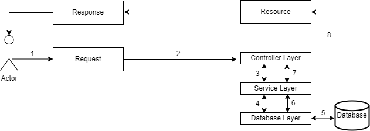
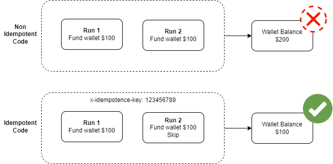
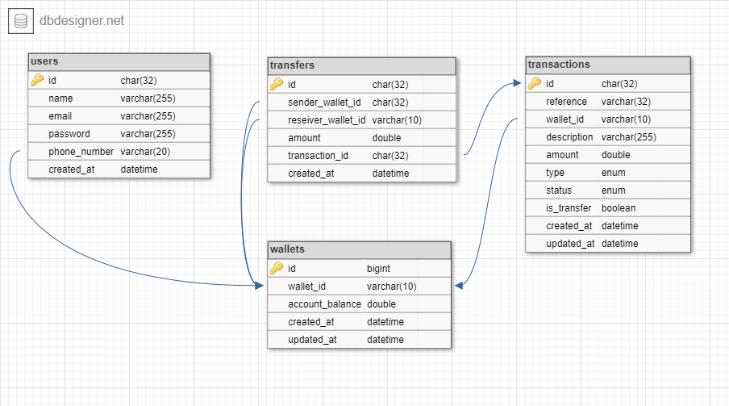

## Design Document

### System Specifications
#### System features
The following are the primary features of the Application.
- SF1: Feature 1
    - A user can create an account
- SF2: Feature 2
    - A user can fund their account
- SF3: Feature 3
    - A user can transfer funds to another user's account
- SF4: Feature 4
    - A user can withdraw funds from their account.

#### Design and Implementation Constraints

**Functional Requirements**:
- *FR1: Feature 1*
    - A user can create an account
        - user signs up with: name, email, password, and phone number
        - users' email and phone number should be unique
        - user wallet should be created upon signup with the phone number provided as the wallet id
        - user should be able to login with email and password
        - authorization token should be used to authorize protected routes
- *FR2: Feature 2*
    - A user can fund their account
        - only logged in user can fund their account
        - each transaction should be unique to avoid duplication (to use idenpotency key)
- *FR3: Feature 3*
    - A user can transfer funds to another user's account
        - only logged in user can transfer from their account
        - a user can only transfer to an existing wallet id
        - a user can transfer only amount that does not exceed his wallet balance
        - each transaction should be unique to avoid duplication (to use idenpotency key)
- *FR4: Feature 4*
    - A user can withdraw funds from their account.
        - only logged in user can withdraw from their account
        - a user can transfer only amount that does not exceed his wallet balance
        - each transaction should be unique to avoid duplication (to use idenpotency key)

**Assumptions**:
- Operates single currency (assume usd)

### Design Pattern
#### 1. Adopted a Layered Approach


Recalling the objectives for layered architecture, I followed the "separation of concerns" principle during development. By dividing the codebase into three categories – *business logic*, *database*, and *API routes*, which fall into three different layers, service layer, controller layer, and data access layer. The idea is to separate the business logic from Node.js API routes to avoid complex background processes.

***Controller layer*** – This layer defines the API routes. The route handler functions let you deconstruct the request object, collect the necessary data pieces, and pass them on to the service layer for further processing.

***Service layer*** – This layer is responsible for executing the business logic. It includes classes and methods that follow S.O.L.I.D programming principles, perform singular responsibilities, and are reusable. The layer also decouples the processing logic from the defining point of routes.

***Data access layer*** – Responsible for handling database, this layer fetches from, writes to, and updates the database. It also defines SQL queries, database connections, models, ORMs, etc.

The three-layered setup acts as a reliable arrangement for Node.js applications. These stages make the application easier to code, maintain, debug and test.

#### 2. Used dependency injection
Dependency injection is a software design pattern that advocates passing (injecting) dependencies (or services) as parameters to modules instead of requiring or creating specific ones inside them. This is a fancy term for a fundamental concept that keeps your modules more flexible, independent, reusable, scalable, and easily testable across the application.

#### 3. Utilized third-party solutions
Node.js has a vast developer community across the world. In addition, Node.js offers a package manager, NPM, which is full of feature-rich, well-maintained, well-documented frameworks, libraries, and tools. Therefore, I conveniently plugged several existing solutions into my code and make the most of their APIs.

Some of the Node.js libraries used to enhance my coding workflows are:
- Nodemon (automatically restarts the app when there’s a code update)
- Winston (logging)
- ESLint, Prettier (code formatter)
- Node-cache (internal caching)
- Swagger (API document)
- REST Client (HTTP client tools)
- PM2 (Advanced, Production process manager for Node.js)
- SWC (a super-fast JavaScript / TypeScript compiler)
- Makefile (This is a setting file of the make program used to make the compilation that occurs repeatedly on Linux)
- NGINX (Web server)
- Docker (Container platform)

#### 4. Applied a uniform folder structure
A folder structure can help you to transform that into reality. Here, I organized different modules into separate folders to clarify various functionalities, classes, and methods used in the application.

Here is a basic folder structure I maitained while setting up a new application in Node.js:

```sh
│
├──📂 .vscode
│  ├── launch.json
│  └── settings.json
│
├──📂 src
│  ├──📂 config
│  │  └── index.ts
│  │
│  ├──📂 controllers
│  │  ├── auth.controller.ts
│  │  └── users.controller.ts
│  │
│  ├──📂 dtos
│  │  └── users.dto.ts
│  │
│  ├──📂 exceptions
│  │  └── httpException.ts
│  │
│  ├──📂 http
│  │  ├── auth.http
│  │  └── users.http
│  │
│  ├──📂 interfaces
│  │  ├── auth.interface.ts
│  │  ├── routes.interface.ts
│  │  └── users.interface.ts
│  │
│  ├──📂 middlewares
│  │  ├── auth.middleware.ts
│  │  ├── error.middleware.ts
│  │  └── validation.middleware.ts
│  │
│  ├──📂 models
│  │  └── users.model.ts
│  │
│  ├──📂 routes
│  │  ├── auth.route.ts
│  │  └── users.route.ts
│  │
│  ├──📂 services
│  │  ├── auth.service.ts
│  │  └── users.service.ts
│  │
│  ├──📂 test
│  │  ├── auth.test.ts
│  │  └── users.test.ts
│  │
│  ├──📂 utils
│  │  ├── logger.ts
│  │  └── vaildateEnv.ts
│  │
│  ├── app.ts
│  └── server.ts
│
├── .dockerignore
├── .editorconfig
├── .env.development.local
├── .env.production.local
├── .env.test.local
├── .eslintignore
├── .eslintrc
├── .gitignore
├── .huskyrc
├── .lintstagedrc.json
├── .prettierrc
├── .swcrc
├── docker-compose.yml
├── Dockerfile.dev
├── Dockerfile.prod
├── ecosystem.config.js
├── jest.config.js
├── Makefile
├── nginx.conf
├── nodemon.json
├── package-lock.json
├── package.json
├── swagger.yaml
└── tsconfig.json
```

#### 5. Implement Idenpotence


According to the [HTTP specification RFC 2616 section 9](https://www.w3.org/Protocols/rfc2616/rfc2616-sec9.html) the HTTP verbs GET, PUT and DELETE are said to be idempotent whereas the verb POST is not idempotent by default. However, we use POST requests to create a resource on the server (or in this case, manage users' wallet). So to avoid duplicate transactions we need to see how we can use some minor tweaks to make the POST method act in an idempotent manner.

All wallet POST requests are interfaced with an idempotence middleware. The middleware checks if the idenpotence key (generated by the client and passed through header as `x-idempotence-key`) exists in a simple and fast internal cache (implemented with [node-cache](https://www.npmjs.com/package/node-cache) package) and treated as a new or duplicate request. Duplicate requests are denied if it exists in the cache.

#### 6. Used linters, formatters, style guide, and comments for clean coding
***Linting and formatting***: To ensure consistency in formatting and styling across your whole project I used *ESLint* for inspecting Javascript code and *Prettier* for code formatting.

***Style guides***: I adopted *Airbnb* style guide for Javascript for code readability, which cover everything from naming conventions formatting to file system encodings and to ensure global standard.

#### 7. Rectify errors with unit testing, logging, and error-handling
***Unit testing***: Used Jest for writing test cases.
***Logging and error-handling***: Build a centralized error-handling component for error handling in Node.js architecture, hence, avoiding duplication.

#### 8. Practice writing asynchronous code
Async/await mode has cleaner code, better readability, and easier error handling, thus, I went for it.

#### 9. Using config file and environment variables
As the application scales, you'll require global configuration options that every module can access. I used a separate file and put everything inside a `config` folder in the project structure.

### E-R Diagram
