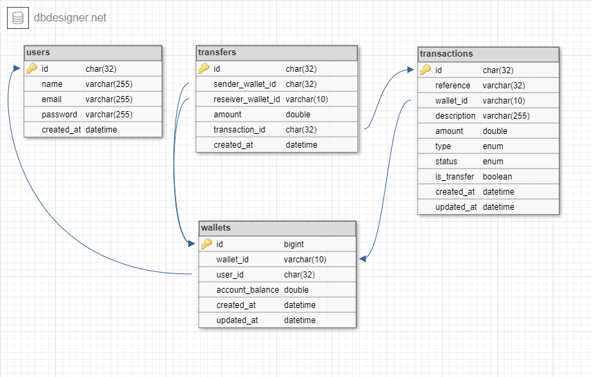

## Demo Credit
Demo Credit is a mobile lending app that requires wallet functionality. This is needed as borrowers need a wallet to receive the loans they have been granted and also send the money for repayments.

### MVP Stories
- A user can create an account
- A user can fund their account
- A user can transfer funds to another user’s account
- A user can withdraw funds from their account.

### Tech Stack
- NodeJS
- KnexJS + Objection ORM
- MySQL database
- Typescript

### Commands

Running locally:

```bash
npm run dev
```

Running in production:

```bash
npm run start
```

Testing:

```bash
# run all tests
npm run test
```

Linting:

```bash
# run ESLint
yarn lint

# fix ESLint errors
yarn lint:fix
```

Database:

```bash
# generate migration file
npm run make:migration

# run migration files
npm run migrate

# rollback latest migration
npm run migrate:rollback

# generate seeder file
npm run make:seeder

# run seeder files
npm run db:seed
```

### Design Documentation
[Here](https://pages.github.com/) is the design documentation

### E-R Diagram

