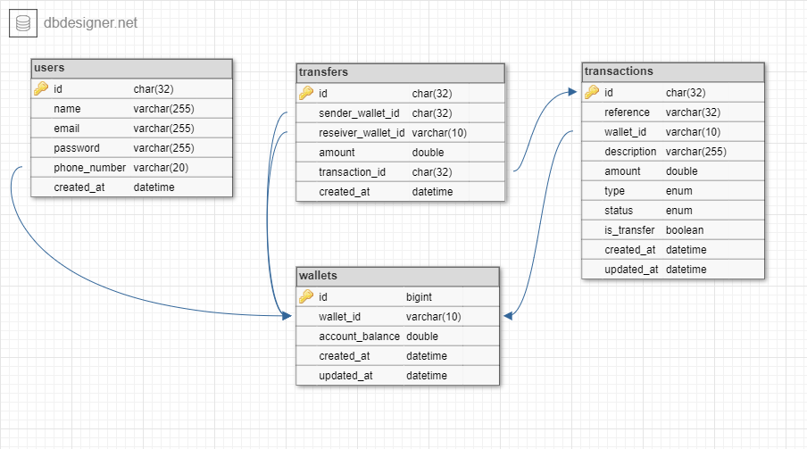

## Demo Credit
Demo Credit is a mobile lending app that requires wallet functionality. This is needed as borrowers need a wallet to receive the loans they have been granted and also send the money for repayments.

### MVP Stories
- A user can create an account
- A user can fund their account
- A user can transfer funds to another user’s account
- A user can withdraw funds from their account.

### Tech Stack
- NodeJS
- KnexJS + Objection ORM
- MySQL database
- Typescript

## Installation

To setup the application, follow these steps:

Clone the repo:

```bash
git clone https://github.com/ifeekz/lendsqr_wallet_api.git
cd lendsqr_wallet_api
```

Install the dependencies:

```bash
npm install
```

Set the environment variables:

```bash
cp .env.example .env.development.local
cp .env.example .env.production.local
cp .env.example .env.test.local

# open .env.*.local (depending on the environment) and modify the environment variables (if needed)
```

### Commands

Running locally:

```bash
npm run dev
```

Running in production:

```bash
npm run start
```

Testing:

```bash
# run all tests
npm run test
```

Linting:

```bash
# run ESLint
npm run lint

# fix ESLint errors
npm run lint:fix
```

Database:

```bash
# generate migration file
npm run make:migration

# run migration files
npm run migrate

# rollback latest migration
npm run migrate:rollback

# generate seeder file
npm run make:seeder

# run seeder files
npm run db:seed
```

Docker:

```bash
# start the containers in the background and leaves them running
docker-compose up -d

# stop containers and removes containers, networks, volumes, and images
docker-compose down
```
Modify `docker-compose.yml` and `Dockerfile` file to suit you.

PM2:

```bash
# production mode
npm run deploy:prod OR pm2 start ecosystem.config.js --only prod

# development mode
npm run deploy:dev OR pm2 start ecosystem.config.js --only dev
```
Modify `ecosystem.config.js` file to suit you.

SWC:

```bash
# tsc build
npm run build

# swc build
swc build :: npm run build:swc
```
Modify `.swcrc` file to suit you.

Makefile:

```bash
# help
make help

# swc build
swc build :: npm run build:swc
```
Modify `Makefile` file to suit you.

### Design Documentation
[Here](DESIGN.md) is the design documentation

### E-R Diagram

